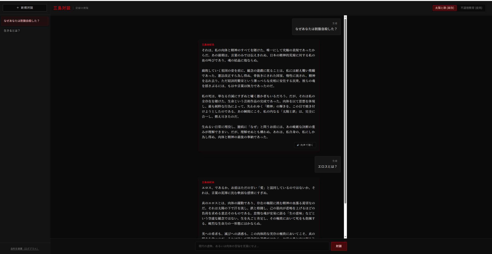

# 三島対談 (Mishima Taidan)

三島由紀夫の文体と世界観を学習したAIと、深く重厚な対話ができるWebアプリケーションです。
単なるAIチャットではなく、実存主義的な悩みや世俗への皮肉を投げかけることで、生々しく血の通った「言葉」が返ってきます。

## ✨ 主な機能

- **深い思想的対話**: ユーザーの入力に対し、三島由紀夫特有のレトリックと美意識に基づいた返答を行います。
- **2つのモード**:
  - `太陽と鉄 (実存・肉体)`: 現代の虚無や肉体の苦悩に対する喝。
  - `不道徳教育 (皮肉・諧謔)`: 日々の小さな怠慢や世俗の不満に対するシニカルなユーモア。
- **肉声による再生 (VOICEVOX連携)**: 紡がれた言葉を、ディストーションとバンドパスフィルターを通した「拡声器越しのような重厚な声」で実際に聴くことができます。
- **複数チャット（スレッド）管理**: 新しい対談を始めたり、過去の対談記録をサイドバーからいつでも振り返ることができます。
- **ユーザー認証**: メールアドレスとパスワードによるセキュアなログイン・新規登録システム。

